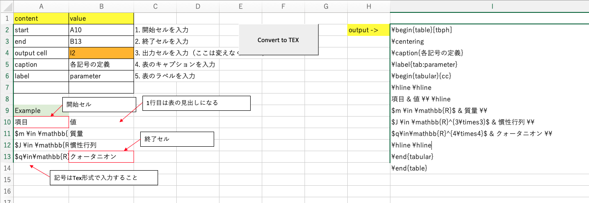

# Excel2Texについて
Excelの表をTexコードに変換するExcelマクロ。
使用するファイルは`Excel2Tex.xlsm`

# 使い方
1. `Excel2Tex.xlsm`を[ダウンロード](https://github.com/ku-gcl/excel2tex/releases)。
1. `Excel2Tex.xlsm`を開く。マクロ（プログラム）を含んでいるため、ファイルを開くか警告が出ると思います。特に問題がなければ、有効を押します。
1. Excelに表を記述する。このとき、表の見出しも記述しておくこと。
1. B2セルに表の開始セルを入力する。
1. B3セルに表の終了セルを入力する。
1. B4セルにはTexコードを出力するセルを入力する。`I2`のままで大丈夫。
1. B5セルに表のキャプションを入力する。
1. B6セルに表のラベルを入力する。`parameter`と入力すると、`\label{tab:parameter}`と出力される。
1. `Convert to TEX`ボタンを押す。
1. B4に入力したセルに、Texコードが出力される。




## 出力例

```
% texコードの出力例  *.tex

\begin{table}[tbph]
\centering
\caption{各記号の定義}
\label{tab:parameter}
\begin{tabular}{cc}
\hline \hline
項目 & 値 \\ \hline
$m \in \mathbb{R}$ & 質量 \\ 
$J \in \mathbb{R}^{3\times3}$ & 慣性行列 \\ 
$q\in\mathbb{R}^{4\times4}$ & クォータニオン \\ 
\hline \hline
\end{tabular}
\end{table}
```
## texでコンパイル後


# スタイルの変更
## 表の一番上の線を太線にする場合
プリアンブルに以下を追加。
プリアンブルとは、Texの一番上にある`usepackage{~~~}`という宣言部分。

```
% main.texなどのプリアンブル

\usepackage{~~~~}
(省略)

% 以下を追加↓
% \Hlineで太線 2ptが大きさ
\makeatletter
\def\Hline{%
\noalign{\ifnum0=`}\fi\hrule \@height 2pt \futurelet
\reserved@a\@xhline}
\makeatother
```

表をExcel2Tex.xlsmで出力し、以下の2箇所を変更。

## 出力例

```
\begin{table}[tbph]
\centering
\caption{各記号の定義}
\label{tab:parameter}
\begin{tabular}{cc}
\Hline      % ←ここを変更
項目 & 値 \\ \hline
$m \in \mathbb{R}$ & 質量 \\ 
$J \in \mathbb{R}^{3\times3}$ & 慣性行列 \\ 
$q\in\mathbb{R}^{4\times4}$ & クォータニオン \\ 
\Hline      % ←ここを変更
\end{tabular}
\end{table}
```
## texでコンパイル後


## 図を好きな位置に配置する
- 参考
[図を好きな位置に配置する](https://qiita.com/poemn/items/9142339749c87ebdb536#%E5%9B%B3%E3%82%92%E5%A5%BD%E3%81%8D%E3%81%AA%E4%BD%8D%E7%BD%AE%E3%81%AB%E9%85%8D%E7%BD%AE%E3%81%99%E3%82%8B)

図を好きな位置に配置するには、`here`パッケージを使う。

プリアンブルに`\usepackage{here}`を追加して、
`\begin{figure}[tbph]`を`\begin{figure}[H]`に変更する。

```
% プリアンブルでパッケージに追加
\usepackage{here}

% 大文字のHを使用することで好きな位置に図を配置
\begin{figure}[H]
```


# Tex tableを作成できる他のサイト

- [Tables Generator](https://www.tablesgenerator.com/latex_tables)
